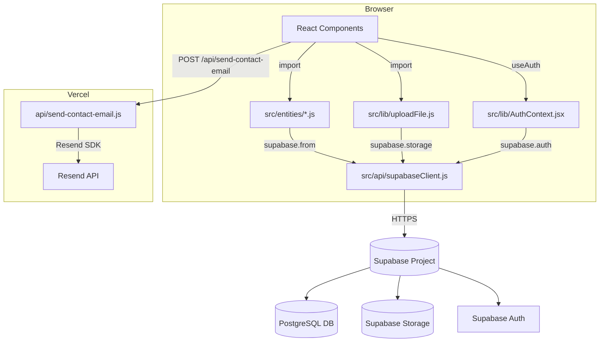

# Design Document: Base44 to Supabase Migration

## Overview

This migration replaces every Base44 runtime dependency in the BalloonCraft React/Vite app with a self-owned stack. The public site and admin panel must remain fully functional throughout. The replacement stack is:

- **Supabase** — PostgreSQL database, authentication, and file storage
- **Resend** — transactional email via a Vercel serverless function
- **Vercel** — hosting, SPA routing, and serverless API routes
- **Git** — version control and Vercel CI/CD trigger

The migration is purely a backend-plumbing swap. No UI layout, routing structure, or user-facing behaviour changes. Every component that previously called `db.entities.*`, `db.auth.*`, or `db.integrations.Core.UploadFile` is updated to call the new equivalents; the component's own render logic is untouched.

---

## Architecture

### Before (Base44)

```
Browser
  └── React App
        ├── globalThis.__B44_DB__ shim (injected by @base44/vite-plugin)
        │     ├── db.auth.*          → Base44 auth service
        │     ├── db.entities.*      → Base44 entity API
        │     └── db.integrations.Core.UploadFile → Base44 storage
        └── src/lib/app-params.js   → Base44 token/app-id management
```

### After (Supabase)

```
Browser
  └── React App
        ├── src/api/supabaseClient.js   → @supabase/supabase-js client (singleton)
        ├── src/lib/AuthContext.jsx     → Supabase Auth (session + onAuthStateChange)
        ├── src/entities/*.js           → thin wrappers over supabase.from(table)
        └── src/lib/uploadFile.js       → supabase.storage.from('site-assets').upload()

Vercel Edge
  └── api/send-contact-email.js        → Resend API call (server-side, keeps API key secret)
```

### Data Flow Diagram



---

## Components and Interfaces

### `src/api/supabaseClient.js`

Exports a single configured `@supabase/supabase-js` client. All other modules import from here — there is exactly one client instance in the app.

```js
// Interface
export const supabase  // SupabaseClient instance
```

Throws a descriptive `Error` at module load time if `VITE_SUPABASE_URL` or `VITE_SUPABASE_ANON_KEY` is missing, so misconfiguration is caught at build/startup rather than silently at runtime.

---

### `src/entities/*.js` — Data Access Layer

Six modules, one per table. Each exports the same six functions so call-sites are a mechanical find-and-replace of `db.entities.Foo` → `import * as Foo from '@/entities/Foo'`.

```ts
// Shared interface (all entity modules)
list(orderBy?: string): Promise<Row[]>
filter(conditions: Record<string, unknown>): Promise<Row[]>
get(id: string): Promise<Row>
create(data: Partial<Row>): Promise<Row>
update(id: string, data: Partial<Row>): Promise<Row>
delete(id: string): Promise<void>
```

Modules: `Project.js`, `ContactSubmission.js`, `SiteContent.js`, `SiteTheme.js`, `Testimonial.js`, `SiteAsset.js`.

Each function calls `supabase.from(TABLE_NAME)`, checks the returned `error` field, and throws `new Error(error.message)` if present. This preserves the existing try/catch patterns in components.

---

### `src/lib/AuthContext.jsx`

Rewritten to use Supabase Auth. Maintains the same context shape so all consumers (`ProtectedRoute`, `AdminLayout`, `App.jsx`) require no changes beyond removing the old `navigateToLogin` / `checkAppState` calls.

```ts
// Context value shape (unchanged public interface)
{
  user: User | null
  isAuthenticated: boolean
  isLoadingAuth: boolean
  logout: () => void
  // removed: navigateToLogin, checkAppState, appPublicSettings, isLoadingPublicSettings, authError
}
```

Implementation:
1. On mount, call `supabase.auth.getSession()` to hydrate state from the existing session cookie/localStorage.
2. Subscribe to `supabase.auth.onAuthStateChange()` to keep state in sync across tabs and after token refresh.
3. `logout()` calls `supabase.auth.signOut()` then navigates to `/admin/login` via `react-router-dom`'s `useNavigate`.

---

### `src/components/ProtectedRoute.jsx`

Simplified — no longer needs `checkUserAuth` or `authError` handling. Reads `isAuthenticated` and `isLoadingAuth` from `AuthContext`. When `isAuthenticated` is false and loading is done, renders `<Navigate to="/admin/login" replace />`.

---

### `src/pages/admin/Login.jsx` *(new)*

A standalone page at `/admin/login`. Not wrapped in `AdminLayout`. Renders an email + password form. On submit calls `supabase.auth.signInWithPassword({ email, password })`. On success, navigates to `/admin`. On error, displays the error message inline.

---

### `src/lib/uploadFile.js` *(new)*

```ts
uploadFile(file: File): Promise<{ file_url: string }>
```

1. Generates a unique path: `${Date.now()}-${file.name}`.
2. Calls `supabase.storage.from('site-assets').upload(path, file, { upsert: true })`.
3. On error, throws `new Error(error.message)`.
4. On success, calls `supabase.storage.from('site-assets').getPublicUrl(path)` and returns `{ file_url: data.publicUrl }`.

---

### `api/send-contact-email.js` *(new — Vercel serverless function)*

```ts
// POST /api/send-contact-email
// Body: ContactSubmission fields
// Returns: 200 OK | 400 Bad Request | 500 Internal Server Error
```

Reads `RESEND_API_KEY`, `CONTACT_EMAIL_TO`, `CONTACT_EMAIL_FROM` from `process.env`. Uses the `resend` npm package to send a notification email. Returns 500 on Resend failure (the contact form still shows success to the visitor since the DB row is already saved).

---

### `src/App.jsx` — Route Changes

The only routing change is adding `/admin/login`:

```jsx
// New route added inside Router
<Route path="/admin/login" element={<Login />} />

// Admin routes wrapped in ProtectedRoute
<Route element={<ProtectedRoute />}>
  <Route path="/admin" element={<AdminLayout />}>
    ...existing admin routes...
  </Route>
</Route>
```

The `AuthenticatedApp` wrapper component and its `isLoadingPublicSettings` / `authError` logic are removed. The app renders immediately; `ProtectedRoute` handles the auth gate.

---

### `vite.config.js`

Remove `@base44/vite-plugin`. Keep `@vitejs/plugin-react`. Add the `@` path alias explicitly (previously provided by the Base44 plugin):

```js
resolve: {
  alias: { '@': path.resolve(__dirname, './src') }
}
```

---

## Data Models

### PostgreSQL Schema (`supabase/migrations/001_initial_schema.sql`)

```sql
-- contact_submissions
CREATE TABLE contact_submissions (
  id          uuid PRIMARY KEY DEFAULT gen_random_uuid(),
  name        text NOT NULL,
  email       text NOT NULL,
  phone       text,
  event_type  text,
  event_date  date,
  message     text NOT NULL,
  status      text NOT NULL DEFAULT 'new',
  created_at  timestamptz NOT NULL DEFAULT now()
);

-- projects
CREATE TABLE projects (
  id              uuid PRIMARY KEY DEFAULT gen_random_uuid(),
  title           text NOT NULL,
  slug            text NOT NULL UNIQUE,
  excerpt         text,
  content         text,
  featured_image  text,
  gallery_images  text[],
  category        text,
  tags            text[],
  meta_title      text,
  meta_description text,
  meta_keywords   text,
  og_image        text,
  status          text NOT NULL DEFAULT 'draft',
  featured        boolean NOT NULL DEFAULT false,
  event_date      date,
  event_location  text,
  client_name     text,
  publish_date    date,
  author          text,
  created_at      timestamptz NOT NULL DEFAULT now()
);

-- site_content
CREATE TABLE site_content (
  id           uuid PRIMARY KEY DEFAULT gen_random_uuid(),
  page_key     text NOT NULL UNIQUE,
  content_json text,
  updated_at   timestamptz NOT NULL DEFAULT now()
);

-- site_themes
CREATE TABLE site_themes (
  id         uuid PRIMARY KEY DEFAULT gen_random_uuid(),
  key        text NOT NULL,
  active     boolean NOT NULL DEFAULT false,
  updated_at timestamptz NOT NULL DEFAULT now()
);

-- testimonials
CREATE TABLE testimonials (
  id         uuid PRIMARY KEY DEFAULT gen_random_uuid(),
  name       text NOT NULL,
  role       text,
  quote      text NOT NULL,
  rating     integer,
  avatar_url text,
  featured   boolean NOT NULL DEFAULT false,
  status     text NOT NULL DEFAULT 'approved',
  created_at timestamptz NOT NULL DEFAULT now()
);

-- site_assets
CREATE TABLE site_assets (
  id         uuid PRIMARY KEY DEFAULT gen_random_uuid(),
  name       text NOT NULL,
  file_url   text NOT NULL,
  category   text,
  tags       text[],
  width      integer,
  height     integer,
  created_at timestamptz NOT NULL DEFAULT now()
);
```

### RLS Policies

```sql
-- Enable RLS on all tables
ALTER TABLE contact_submissions ENABLE ROW LEVEL SECURITY;
ALTER TABLE projects            ENABLE ROW LEVEL SECURITY;
ALTER TABLE site_content        ENABLE ROW LEVEL SECURITY;
ALTER TABLE site_themes         ENABLE ROW LEVEL SECURITY;
ALTER TABLE testimonials        ENABLE ROW LEVEL SECURITY;
ALTER TABLE site_assets         ENABLE ROW LEVEL SECURITY;

-- contact_submissions: public INSERT, auth-only SELECT/UPDATE/DELETE
CREATE POLICY "public_insert_contact" ON contact_submissions FOR INSERT TO anon WITH CHECK (true);
CREATE POLICY "auth_all_contact"      ON contact_submissions FOR ALL   TO authenticated USING (true) WITH CHECK (true);

-- projects: public SELECT published, auth full CRUD
CREATE POLICY "public_read_published_projects" ON projects FOR SELECT TO anon USING (status = 'published');
CREATE POLICY "auth_all_projects"              ON projects FOR ALL   TO authenticated USING (true) WITH CHECK (true);

-- site_content: public SELECT, auth write
CREATE POLICY "public_read_site_content" ON site_content FOR SELECT TO anon USING (true);
CREATE POLICY "auth_write_site_content"  ON site_content FOR ALL   TO authenticated USING (true) WITH CHECK (true);

-- site_themes: public SELECT, auth write
CREATE POLICY "public_read_site_themes" ON site_themes FOR SELECT TO anon USING (true);
CREATE POLICY "auth_write_site_themes"  ON site_themes FOR ALL   TO authenticated USING (true) WITH CHECK (true);

-- testimonials: public SELECT approved, auth full CRUD
CREATE POLICY "public_read_approved_testimonials" ON testimonials FOR SELECT TO anon USING (status = 'approved');
CREATE POLICY "auth_all_testimonials"             ON testimonials FOR ALL   TO authenticated USING (true) WITH CHECK (true);

-- site_assets: public SELECT, auth write
CREATE POLICY "public_read_site_assets" ON site_assets FOR SELECT TO anon USING (true);
CREATE POLICY "auth_write_site_assets"  ON site_assets FOR ALL   TO authenticated USING (true) WITH CHECK (true);
```

### Supabase Storage

One public bucket named `site-assets`. Bucket policy: public read, authenticated write. Files are stored with path `{timestamp}-{original_filename}` to avoid collisions.

### Environment Variables

| Variable | Used by | Description |
|---|---|---|
| `VITE_SUPABASE_URL` | Browser (build-time) | Supabase project URL |
| `VITE_SUPABASE_ANON_KEY` | Browser (build-time) | Supabase anon/public key |
| `RESEND_API_KEY` | Vercel function (runtime) | Resend API key |
| `CONTACT_EMAIL_TO` | Vercel function (runtime) | Recipient address for contact notifications |
| `CONTACT_EMAIL_FROM` | Vercel function (runtime) | Sender address (must be verified in Resend) |

---

## Correctness Properties

*A property is a characteristic or behavior that should hold true across all valid executions of a system — essentially, a formal statement about what the system should do. Properties serve as the bridge between human-readable specifications and machine-verifiable correctness guarantees.*

### Property 1: No Base44 references remain in source files

*For any* source file in `src/` or `api/`, the file content shall not contain the strings `@base44`, `__B44_DB__`, `db.entities`, `db.auth`, `db.integrations`, or `appParams`.

**Validates: Requirements 1.1, 1.2, 1.3, 1.5**

---

### Property 2: Entity module error propagation

*For any* entity module operation (`list`, `filter`, `get`, `create`, `update`, `delete`) where the Supabase client returns a non-null `error` object, the module shall throw a JavaScript `Error` whose message equals the Supabase error message.

**Validates: Requirements 5.8**

---

### Property 3: Entity filter applies all conditions

*For any* conditions object passed to `filter()`, the resulting Supabase query shall include an `.eq(key, value)` call for every key-value pair in the conditions object — no conditions are silently dropped.

**Validates: Requirements 5.3**

---

### Property 4: Entity create returns persisted record

*For any* valid data object passed to `create()`, the returned record shall contain the original data fields plus a non-null `id` (UUID) and a non-null `created_at` timestamp.

**Validates: Requirements 5.5**

---

### Property 5: uploadFile returns a valid HTTPS URL

*For any* `File` object passed to `uploadFile()`, the returned `file_url` shall be a string that starts with `https://` and is non-empty.

**Validates: Requirements 6.2**

---

### Property 6: uploadFile error leaves caller state unchanged

*For any* Supabase Storage error encountered during `uploadFile()`, the function shall throw an `Error` (allowing the calling component to catch it and display a toast) rather than returning a partial or empty result.

**Validates: Requirements 6.7**

---

### Property 7: useSiteContent falls back to DEFAULT_CONTENT

*For any* `page_key` for which no row exists in `site_content`, `useSiteContent(pageKey)` shall return the value at `DEFAULT_CONTENT[pageKey]` (or `{}` if the key is absent from defaults) rather than `null` or `undefined`.

**Validates: Requirements 9.1**

---

### Property 8: useAllSiteContent DB values override defaults

*For any* set of `site_content` rows returned by Supabase, `useAllSiteContent()` shall return a map where each `page_key` present in the DB overrides the corresponding `DEFAULT_CONTENT` entry, while keys absent from the DB retain their default values.

**Validates: Requirements 9.2**

---

### Property 9: Public project queries exclude non-published rows

*For any* projects table state containing rows with mixed `status` values, the query issued by the `Projects` page shall include a `.eq('status', 'published')` filter so that draft and archived projects are never returned to public visitors.

**Validates: Requirements 9.4**

---

### Property 10: Public testimonial queries exclude non-approved rows

*For any* testimonials table state containing rows with mixed `status` values, the query issued by the `Testimonials` page shall include a `.eq('status', 'approved')` filter so that pending and hidden testimonials are never returned to public visitors.

**Validates: Requirements 9.6**

---

### Property 11: Contact form submission includes all provided fields in notification email

*For any* valid contact form submission containing name, email, message, and any combination of optional fields (phone, event_type, event_date), the email sent by the Vercel function shall include every field that was provided in the submission body.

**Validates: Requirements 7.3, 7.4**

---

### Property 12: Unauthenticated access to any /admin/* route redirects to login

*For any* path matching `/admin/*` (including `/admin`, `/admin/projects`, `/admin/messages`, etc.), a user with `isAuthenticated = false` shall be redirected to `/admin/login` by `ProtectedRoute`.

**Validates: Requirements 4.2, 4.8**

---

### Property 13: Login error display for any signInWithPassword failure

*For any* error object returned by `supabase.auth.signInWithPassword()`, the Login page shall render a non-empty, visible error message to the user.

**Validates: Requirements 4.4**

---

## Error Handling

### Supabase Query Errors

All entity modules follow the same pattern:

```js
const { data, error } = await supabase.from(TABLE).select('*');
if (error) throw new Error(error.message);
return data;
```

Components that call entity modules already use React Query's `isError` / `error` states. No changes needed to component error UI.

### Auth Errors

`AuthContext` catches errors from `getSession()` and `onAuthStateChange()`. On any auth error, `isAuthenticated` is set to `false` and `isLoadingAuth` to `false`, which causes `ProtectedRoute` to redirect to `/admin/login`.

### Upload Errors

`uploadFile` throws on storage error. `ImageUploadField` wraps the call in try/catch and calls `toast.error(err.message)`. The `onChange` callback is not called, so the existing image value is preserved.

### Contact Email Errors

The Vercel function returns HTTP 500 on Resend failure. The `Contact.jsx` page calls the function with `fetch` after the DB insert succeeds. If the fetch returns a non-2xx status, the page logs the error but still shows the success message to the visitor (the submission is already persisted).

### Missing Environment Variables

`supabaseClient.js` checks for `VITE_SUPABASE_URL` and `VITE_SUPABASE_ANON_KEY` at module load time and throws a descriptive `Error` if either is absent. This surfaces as a build-time or startup error rather than a silent runtime failure.

---

## Testing Strategy

### Unit Tests (Vitest)

Focus on the new modules introduced by this migration:

- **`src/api/supabaseClient.js`** — verify it throws when env vars are missing; verify it exports a client instance when they are present.
- **`src/entities/*.js`** — mock `supabase.from()` and verify each function builds the correct query chain and throws on error. These are the primary targets for property-based tests (see below).
- **`src/lib/uploadFile.js`** — mock `supabase.storage` and verify URL construction and error propagation.
- **`src/lib/AuthContext.jsx`** — mock `supabase.auth` and verify `getSession` is called on mount, `onAuthStateChange` is subscribed, and `logout` calls `signOut`.
- **`src/pages/admin/Login.jsx`** — render with mocked supabase, verify form submission calls `signInWithPassword`, verify error display, verify redirect on success.
- **`api/send-contact-email.js`** — mock Resend, verify email fields are populated from request body, verify 500 on Resend error.

### Property-Based Tests (fast-check, minimum 100 iterations each)

Property-based tests use [fast-check](https://github.com/dubzzz/fast-check) to generate random inputs and verify universal properties. Each test is tagged with a comment referencing the design property it validates.

**Feature: base44-to-supabase-migration, Property 2: Entity module error propagation**
Generate random Supabase error objects; for each entity operation, verify a `Error` is thrown with the correct message.

**Feature: base44-to-supabase-migration, Property 3: Entity filter applies all conditions**
Generate random conditions objects (arbitrary key-value pairs); verify `.eq()` is called for every entry.

**Feature: base44-to-supabase-migration, Property 4: Entity create returns persisted record**
Generate random data objects; verify the returned record contains all input fields plus `id` and `created_at`.

**Feature: base44-to-supabase-migration, Property 5: uploadFile returns a valid HTTPS URL**
Generate random `File`-like objects; mock storage to return a path; verify the returned URL starts with `https://`.

**Feature: base44-to-supabase-migration, Property 7: useSiteContent falls back to DEFAULT_CONTENT**
Generate random page keys; for each, mock an empty DB response and verify the hook returns the default.

**Feature: base44-to-supabase-migration, Property 8: useAllSiteContent DB values override defaults**
Generate random sets of `site_content` rows; verify DB values override defaults and absent keys retain defaults.

**Feature: base44-to-supabase-migration, Property 9: Public project queries exclude non-published rows**
Generate random arrays of projects with mixed statuses; verify the query filter only returns `published` ones.

**Feature: base44-to-supabase-migration, Property 10: Public testimonial queries exclude non-approved rows**
Generate random arrays of testimonials with mixed statuses; verify only `approved` ones are returned.

**Feature: base44-to-supabase-migration, Property 11: Contact form notification email includes all provided fields**
Generate random contact submissions with varying optional fields; verify the email body contains every provided field.

**Feature: base44-to-supabase-migration, Property 12: Unauthenticated access to any /admin/* route redirects to login**
Generate random admin sub-paths; render `ProtectedRoute` with `isAuthenticated=false`; verify redirect to `/admin/login`.

**Feature: base44-to-supabase-migration, Property 13: Login error display for any signInWithPassword failure**
Generate random error objects from `signInWithPassword`; verify a non-empty error message is rendered.

### Integration Tests

Run against a real Supabase project (test environment):

- Verify RLS policies: anonymous INSERT to `contact_submissions` succeeds; anonymous INSERT to `projects` fails; authenticated INSERT to `projects` succeeds.
- Verify `uploadFile` stores a file and the returned URL is publicly accessible.
- Verify the Vercel function sends an email end-to-end (use Resend test mode).

### Smoke Tests

- `vite build` exits with code 0 after removing Base44 packages.
- `vercel.json` routes are valid JSON and contain the SPA fallback rule.
- `.env.example` lists all five required environment variables.
